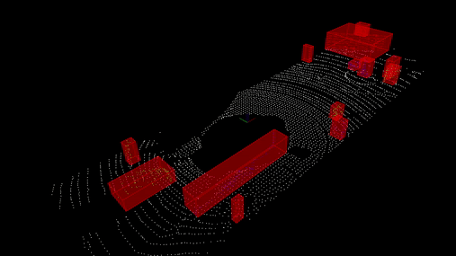

# Obstacle Detection Using LiDAR point cloud data
This project is part of Udacity's Sensor Fusion Course.

### In this project we process LiDAR point cloud data using PCL library for object detection. The pipeline includes the follwing steps:

**1. Downsampling** - Downsample the point cloud to reduce computation.

**2. Segmentation** - Detect the major plane i.e. road surg=face using RANSAC.

**3. Clustering** - Cluster the individual object point clouds together. 

**4. Bounding Box** - Put a bounding box around the individual object point cloud clusters.

